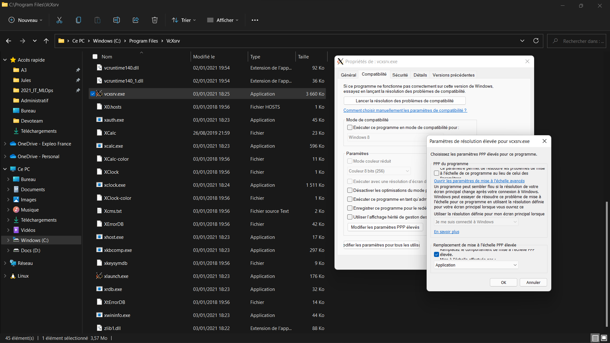
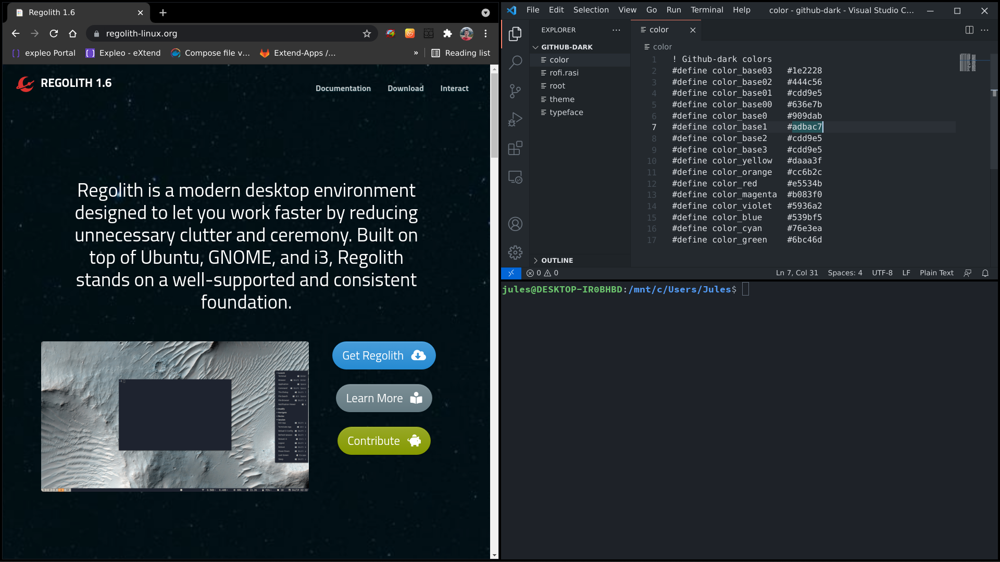

# This is a guide for using Regolith and WSL together

## How to install regolith-i3 on WSL2

### 1. Install WSL2 Ubuntu
```shell
wsl.exe --install
```
You can follow this [tutorial](https://docs.microsoft.com/en-us/windows/wsl/install-win10)

### 2. Install Vcxsrv (X server for Windows)
Follow this Sourceforge link: [Vcxsrv](https://sourceforge.net/projects/vcxsrv/)

### 3. Install [Regolith](https://regolith-linux.org/)
On WSL, run:
```shell
sudo add-apt-repository ppa:regolith-linux/release
sudo apt install regolith-desktop-standard
```

### 4. Create launch files
- Copy the `wsl/scripts` folder onto your WSL home directory (Linux home)
- Copy the file `windows/wslup.vbs` where you want
- Modify the `Linux.Ink` so that it points to the `wslup.vbs` file

### 5. Configure WSL2
You'll need to disable the WSLg feature which is the official binding to run linux graphical apps into windows.
Disabling it allows us to use the X server we just installed instead of WSLg.
To do that, you can copy the `windows/.wslconfig` file in your Windows user directory.

### 5. Configure Vcxsrv for DPI (High resolution screen)
In case you have activated DPI in Windows (rescaling) because of a high resolution screen, you need to disable it in for the vcxsrv application.
It will solve the blur problem on vcxsrv.
Access the properties panel of vcxsrv.exe app and modify it like that: 


### 6. Configure Regolith
You can set the DPI scaling you want in the `Xresources` file.
Copy the `wsl/regolith/config/regolith` folder under `~/.config/`.
You can apply the custom regolith Github-dark theme by putting `wsl/regolith/styles/github-dark` under `/etc/regolith/styles`.

### 7. You're all set !
Here is what it should look like :

